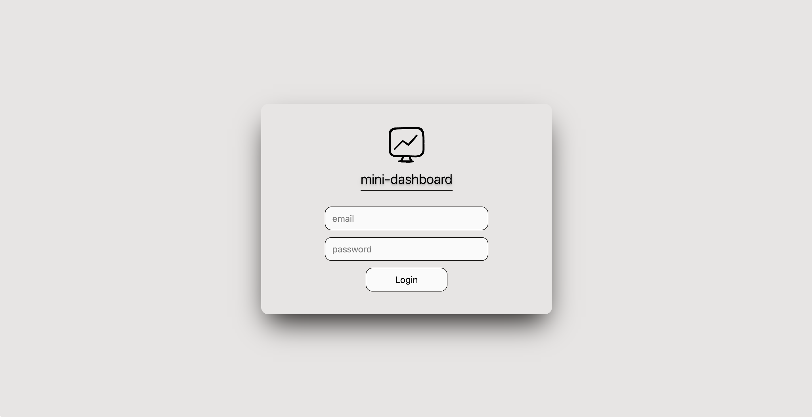
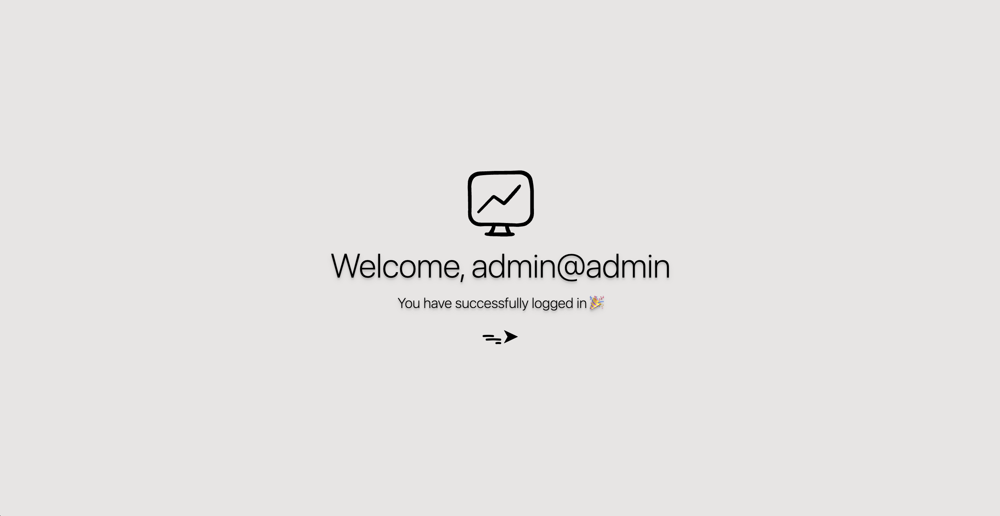
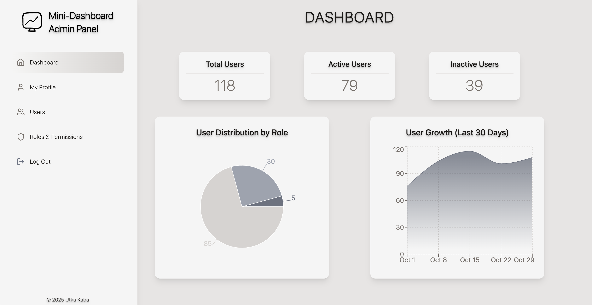
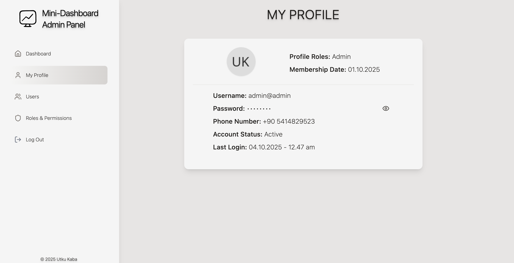
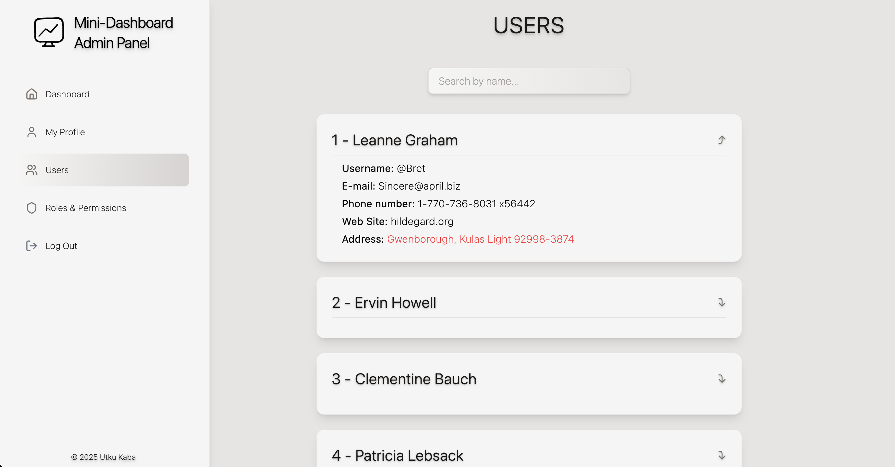
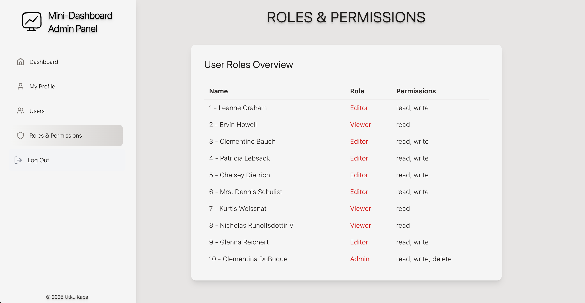

# Mini-Dashboard

A simple user listing app built with **React** and **Vite**. **Vitest** was used for the application's unit tests.
Data is fetched from **JSONPlaceholder API** and displayed in responsive user cards with a **fixed sidebar** layout.

---

## 🚀 Features
- Dynamic user data — Fetches and displays real-time user information from the JSONPlaceholder API.
- Search and filter functionality — Quickly filter users by name with a smooth and responsive interface.
- Expandable user details — View full user information with one click for a clean and intuitive experience.
- Modern responsive layout — Adaptive card-based design optimized for all screen sizes.
- Persistent sidebar navigation — Fixed sidebar for seamless navigation across the application.
- Interactive dashboard — Visualize key metrics like total users, active/inactive distribution, and user growth using Recharts.
- Roles & Permissions management — Displays user roles and access levels in a structured, readable format.
- Lightning-fast development environment — Built with Vite, ensuring rapid builds and smooth hot module replacement. 

---

## 🧱 Tech Stack
- **React** – UI components  
- **Vite** – Build & dev environment
- **Vitest** - Unit Test
- **React Router DOM** – Page routing  
- **Tailwind CSS** – Styling  
- **JSONPlaceholder** – Mock API
- **Rechart** – Charts 

---

## ⚙️ Setup
```bash
npm install
npm run dev
```

---
- coverage report:

- login screen:

- welcome screen:

- dashboard screen:

- profile screen:

- users screen:

- roles screen:



